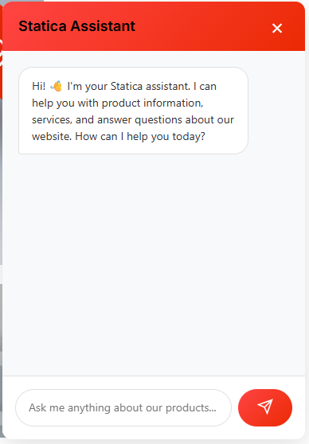
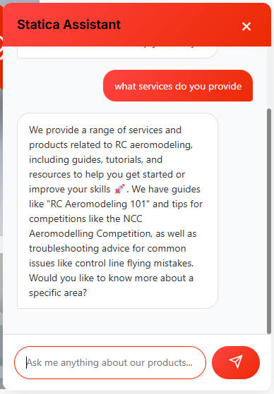

# Statica Free Cloud RAG Chatbot  
A free, lightweight, cloud-powered RAG chatbot plugin for WordPress & WooCommerce.  
Uses **Hugging Face**, **Groq**, or **Together AI** APIs — all with **free tiers** available.

---

## 🛠 Development Note  
This plugin was **fully developed by Shantanu Harkulkar while working on AI automation solutions for Statica**, with a focus on building a free, efficient, cloud-powered RAG chatbot that any website can use.  
It is designed in a personalized way for Statica’s workflow, but you can use it as a reference to build your own version — or you can take my help if you need guidance.

---
## 🚀 Features
- 🧠 Cloud-based AI chatbot (no local models needed)  
- 📑 Automatic RAG indexing for:
  - WooCommerce Products  
  - WordPress Posts  
  - WordPress Pages  
- ⚡ Instant replies for greetings, payments, shipping, returns, etc.  
- 🔍 Smart intent detection (product search, pricing, comparison, info, etc.)  
- 🛠 Admin panel to configure API keys & provider  
- 💬 Beautiful floating chatbot widget  
- 🔐 AJAX secure communication  

---

## 📸 Screenshots

### 🟠 Chatbot Popup UI  

--
### 🟠 Chatbot Conversation Example  



---

## 🛠 Supported Free Providers
| Provider | Free Tier | Notes |
|---------|-----------|-------|
| **Hugging Face** | Unlimited free inferencing for small models | Recommended |
| **Groq** | 14,400 requests/day free | Very fast |
| **Together AI** | $5 free credit | Supports mixtral, llama |

---

## 📦 Installation
1. Download the plugin folder.  
2. Upload to:  
   `/wp-content/plugins/statica-free-cloud-chatbot/`  
3. Activate plugin in **WordPress → Plugins**.  
4. Go to **Statica Chatbot** in sidebar.  
5. Add API provider + API key.  
6. Click **“Index Website Content”** to generate the RAG database.

---

## 🧩 How It Works

### 1. Indexer  
Extracts & stores:
- Product titles, descriptions, categories, tags, URLs  
- Pages (full content + excerpt)  
- Posts (content, categories)

Stored in:
```

/data/vector_db.json

```

### 2. Intent Detector  
Understands queries like:
- “show me products”  
- “price of…”  
- “compare these”  
- “shipping details”  
- “payment options”  
- “refunds / returns”  

### 3. AI Response Generator  
Sends the prompt + context to the selected API provider and returns a friendly, formatted chatbot reply.

---

## 📎 Files Overview
```

statica-free-cloud-chatbot/
│
├── statica-chatbot.php (main plugin)
├── data/
│   └── vector_db.json (indexed website data)
├── assets/
│   ├── chatbot.css
│   └── chatbot.js
└── includes/
└── widget-template.php

```

---

## ⚙️ Configuration
Go to:  
**WP Admin → Statica Chatbot**

Options:
- Choose provider (HuggingFace / Groq / TogetherAI)  
- Add API key  
- Re-index site content  

---

## 💬 Chat Widget  
Rendered automatically in `<footer>` using:

```

wp_footer → render_chatbot_widget()

```

---

## 🤝 Contributing
Pull requests and improvements are welcome.

---

## 📄 License  
GPL v2 or later

---

## 👨‍💻 Author  
**Shantanu Harkulkar**  
Creator of Statica Free Cloud RAG Chatbot  


